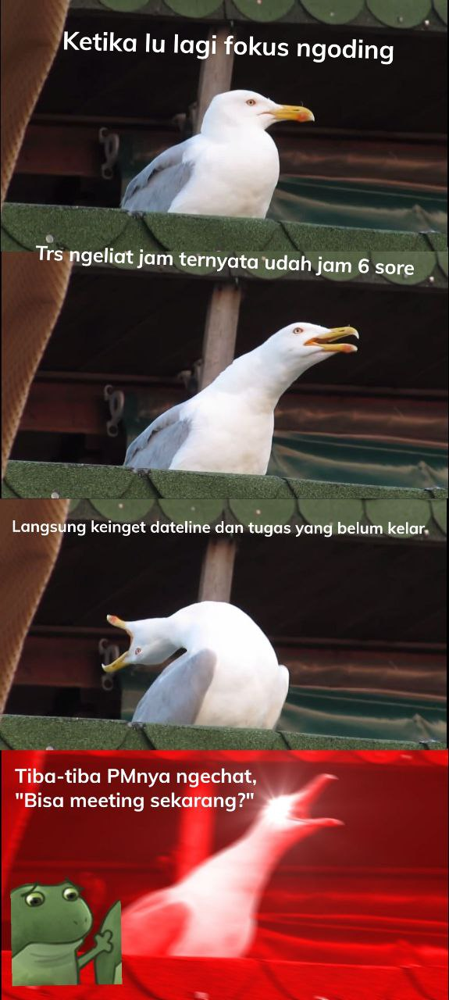
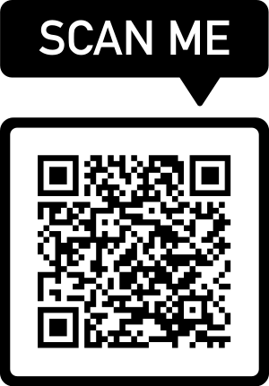
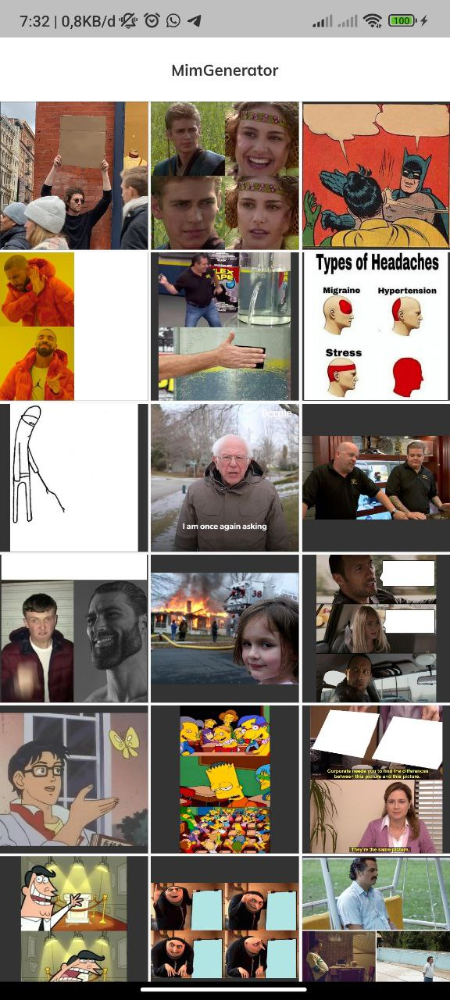
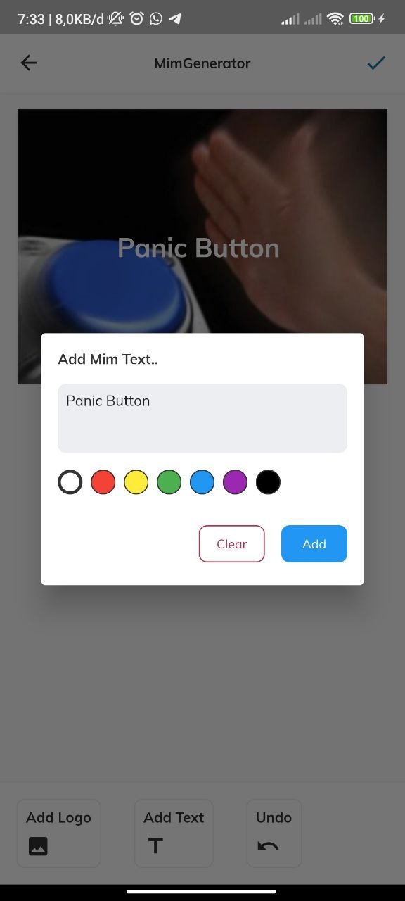
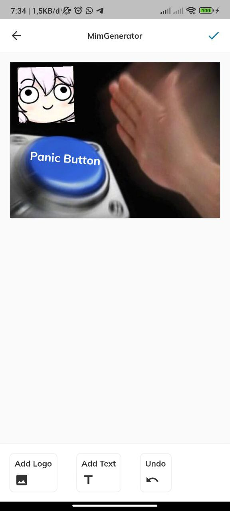
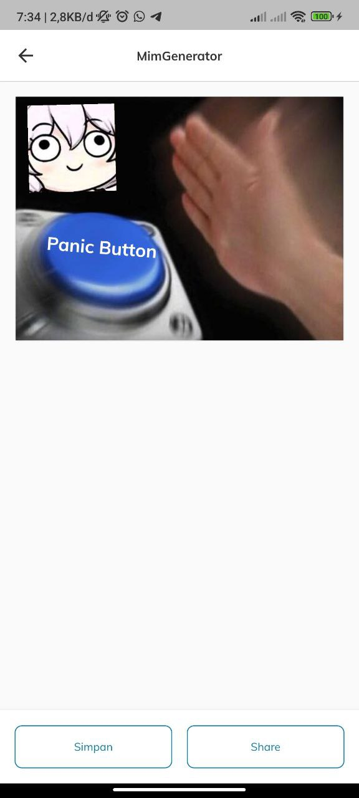
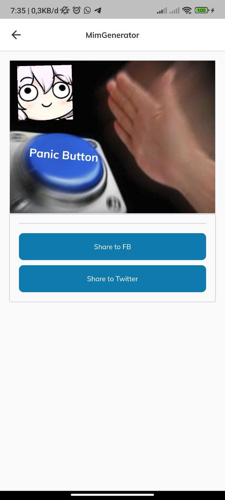

# mim_generator

    
    

Aplikasi untuk membuat meme, anda bisa menambahkan component text, dan gambar. Sesuaikan component tersebut sesuka hati anda, karena component tersebut bisa di scale, drag & drop 🥳.
Jika anda salah dalam menaruh component jangan khawatir ada fitur undo juga untuk menghapus component.

## Third Party

Project ini menggunakan kumpulan meme dari sumber berikut:

- [ImgFlip: 100 Memes](https://imgflip.com/api)

Saat share image ke Twitter, gambar hanya boleh berupa link saja, oleh karena itu saya menguploadnya terlebih dahulu ke imgbb:

- [imgbb: Free post Images](https://api.imgbb.com/)

## Screenshot demo

      
      
      
      
      

